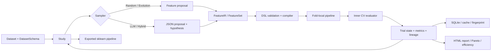

# Featune

Built with PriorLabs-TabPFN

**面向表格数据的可审计特征工程搜索。**

Featune 把字段语义、候选特征、交叉验证和资源预算放进同一条可恢复的搜索链路。它支持无 LLM 的随机/进化搜索，也支持让 LLM 提出业务假设；所有提议都会经过受限 DSL、编译器和独立评估器验证，模型生成的代码不会直接执行。

<p align="center">
  <a href="LICENSE"></a>
  
</p>

中文 · [English](README_en.md) · [使用指南](docs/zh/guide.md) · [DSL/API](docs/zh/reference.md) · [实验结果](benchmarks/README.md) · [Kaggle 示例](examples/kaggle/README.md)

## 为什么是 Featune

传统 AutoFE 擅长枚举数值变换，LLM 擅长提出业务假设，但两者都容易留下不可审计的搜索过程。Featune 的重点是把“想法”变成“可验证、可恢复的实验对象”：

| 问题 | Featune 的做法 |
|---|---|
| LLM 生成任意代码 | LLM 只能返回受控 JSON；FeatureIR 只允许白名单算子 |
| 特征看起来合理但没有效果 | baseline 参与选择，候选必须通过内层 CV |
| 数据泄漏 | 编译和统计变换在训练 fold 内拟合；外层测试只评估一次 |
| 搜索失败后无法解释 | 每个 trial 保存状态、父特征集、假设、错误和资源消耗 |
| 重跑结果不可比较 | 数据/配置/依赖指纹、固定 split hash 和 SQLite 事务持久化 |
| LLM 变贵或上下文过长 | token/cost/time budget、上下文上限、缓存和明确失败状态 |

Featune 不是“保证超过 OpenFE 的分数”的包装器。它的差异化价值是**约束、语义、证据和恢复**，精度提升必须通过外层测试集和多 seed 实验验证。

### 与暴力特征交互组合的关系

如果字段少、主要是数值列、只关心最终分数，直接枚举二阶交互或使用 GBDT 往往更快；Featune 不试图在这个场景取代它们。Featune 解决的是暴力组合难以覆盖的部分：业务语义、类别/时间/分组约束、泄漏边界、候选假设、失败记录、预算和断点恢复。它的目标是让特征搜索**可控、可解释、可复现实验**，而不是承诺在所有数据集上获得更高 AUC。

## 架构



核心边界：

- **Schema 层**描述字段名、类型、单位、业务含义、目标和不可用字段；原始行和标签不会发送给 LLM。
- **Sampler 层**只负责提出候选，不负责决定候选有效；Random、Evolution、LLM、Hybrid 共用同一验证链路。
- **IR/compiler 层**将候选特征编译成 sklearn pipeline。算子、名称、类型、依赖和训练时统计都受校验。
- **Evaluator 层**负责分层、分组、时间或自定义 CV；候选只在训练 fold 上拟合。
- **Storage 层**保存 trial、FeatureSet hash、lineage、cache、预算和 fingerprint，支持中断后恢复。
- **Reporting 层**展示资源效率、假设、特征演化、相关方向和 Pareto frontier。

## 什么时候使用

适合：

- 字段有业务含义，需要让模型搜索结合领域知识；
- 需要审计“为什么提出这个特征、是否真的提升、花了多少资源”；
- 有分类字段、时间字段、分组或时间序列 CV 约束；
- 搜索可能运行数小时，需要恢复、去重、预算和失败记录；
- 希望同一套实验同时支持无 LLM baseline、LLM 语义搜索和 OpenFE 等外部对照。

不适合：

- 只需要一次简单的 `log(x)`，直接写 sklearn `Pipeline` 更简单；
- 需要因果结论、自动发现隐藏标签或替代业务数据治理；
- 需要对数十亿行数据无界枚举候选，应该先做采样、聚合或离线特征仓库设计。

## 安装

Python 3.10+：

```bash
python -m venv .venv
source .venv/bin/activate
pip install featune
```

在仓库中运行开发示例或基准测试时安装可选依赖：

```bash
pip install -e '.[benchmark]'                 # OpenFE、LightGBM、公开数据集实验
pip install -e '.[dev]'   # 开发与完整测试
```

默认安装包含固定版本 TabPFN、PyTorch 和 Plotly，无需单独安装 visualization。默认推理在本地执行，不需要 LLM API key；首次使用下载模型权重，缓存后支持离线运行。macOS 依赖 LightGBM 时可能需要 `brew install libomp`。

默认模型固定为 **TabPFN-2 / tabpfn==9.0.0**，分类与回归权重锁定 revision 和 SHA-256，不跟随上游 latest。默认限制为 10,000 个训练样本、500 列、分类 2–10 类；CPU 最多 1,000 行。安装默认包含 visualization；首次拟合自动下载公开 v2 权重，无需 v3.5 账户认证，仍须遵守 v2 许可。

如需 3.x 系列，显式使用 `featune.TabPFNClassifier(model_version="v3.5")` 或对应回归器；当前提供的是固定 **3.5** 预设，不将它与 3.0 混用。交互式终端首次下载会自动打开官方登录页，用户确认许可并通过浏览器回调后自动继续下载。无浏览器/无交互终端环境需预先配置授权凭证。

**许可约束：Featune 的 MIT 许可不覆盖模型权重。** v2 适用随包 Prior Labs 许可及署名要求；可选 3.5 仅允许符合条款的非商业、非生产用途，商业/生产及收费或免费托管、API、SaaS 服务需另行授权，输出用途也受限。详见 [模型选择与许可说明](docs/zh/reference.md#默认-tabpfn-模型)。

## 五分钟示例

```python
import numpy as np
import pandas as pd
import featune

rng = np.random.default_rng(42)
X = pd.DataFrame({
    "loan": rng.uniform(1, 20, 200),
    "income": rng.uniform(1, 10, 200),
})
y = (X["loan"] / X["income"] > 2).astype(int)

schema = featune.DatasetSchema(fields=[
    featune.FieldSchema(name="loan", description="申请时贷款余额", unit="CNY"),
    featune.FieldSchema(name="income", description="申请时月可支配收入", unit="CNY/month"),
], objective="预测申请是否进入高负债区间")

study = featune.create_study(metric="auc", sampler=featune.RandomSampler(seed=42))
study.optimize(
    X, y, schema=schema,
    n_trials=3,
)
print(study.best_value)
print(study.best_features)
pipeline = study.export_pipeline()
```

`best_value` 是内层 CV 分数。正式实验应保留独立外层测试集：

```bash
python examples/quickstart.py
featune optimize examples/config.json
featune report --storage runs --study-name cli-demo --output runs/cli-demo/report.html
```

[中文 notebook](examples/quickstart_zh.ipynb) 和 [English notebook](examples/quickstart_en.ipynb) 按数据切分、Schema、搜索、评估、解释、导出和可选 LLM 的顺序讲解 API。可从仓库根目录或 `examples/` 启动；LLM 单元格需显式设置 `RUN_LLM=True` 且配置好环境变量。

### Kaggle Playground：默认 TabPFN v2

两份 Playground Notebook 使用 Featune 默认的 TabPFN v2。由于单次训练限制为 GPU 最多 10,000 行、CPU 最多 1,000 行，示例先留出独立验证集，再分层抽样训练；最后在全部竞赛测试行上分批预测。Notebook 会打印实际训练样本量，**不声称使用全部训练行**。Featune 在相同的交叉验证折上比较原始字段与受控特征。完整数据读取、Schema、搜索、验证、提交说明见 [Kaggle 示例](examples/kaggle/README.md)。

公开 Notebook：[S6E9 电动车购买预测](https://www.kaggle.com/code/yaaangzhou/featune-ev-purchase-with-tabpfn-v2) · [S6E8 手机成瘾预测](https://www.kaggle.com/code/yaaangzhou/featune-smartphone-addiction-tabpfn-v2)。运行记录与提交分数见示例文档。

## LLM 语义搜索

```bash
export FEATUNE_API_KEY='your-key'
export FEATUNE_MODEL='your-model-id'
python examples/claude_search.py --trials 3
```

```python
sampler = featune.LLMSampler(
    provider="anthropic", max_tokens=2048,
    token_budget=100_000, features_per_trial=1,
)
study = featune.create_study(sampler=sampler, storage="runs", study_name="credit")
study.optimize(X, y, schema=schema, n_trials=3)
```

提示词只发送 schema、目标、受控特征定义、历史 trial 指标和假设，不发送原始数据行。输出必须是可解析 JSON，经重复 key/non-finite 检查、Pydantic 校验、FeatureIR 白名单校验和实际 CV 后才会进入最佳特征集。Anthropic-compatible endpoint 自动补齐 `/v1/messages`；OpenAI Chat Completions 与自定义网关示例见 [使用指南](docs/zh/guide.md#llm-协议与预算)。

## 能力总览

| 层 | 能力 |
|---|---|
| Schema | 字段语义、类型、单位、目标、分区、排除字段 |
| FeatureIR | 统一特征身份、依赖、hash、parent/child lineage |
| Compiler | 18 个受控算子、类型检查、fold-local 统计、sklearn pipeline |
| Search | baseline、random、evolution、LLM、hybrid、greedy/beam、去重、早停 |
| Evaluation | 分类/回归、多指标、分层/group/time/custom CV、permutation importance |
| Reliability | SQLite 事务、单写者锁、六层缓存、预算、恢复、实验 fingerprint |
| Evidence | trial 状态、假设、失败原因、特征演化、资源表、Pareto frontier |
| PyTorch | MLP、分类 embedding、架构/特征联合搜索 |
| Interfaces | Python、Jupyter、CLI、完整拟合 pipeline 导出、离线 HTML 报告 |

## 指标与实验协议

Featune 不只保存最终分数：

| 指标 | 含义 |
|---|---|
| `test_score` | 外层 holdout 的最终指标；只在选定 pipeline 上评估一次 |
| `inner_best` / `inner_baseline` | 搜索阶段内层 CV 的最佳值和原始 baseline |
| `evaluations_to_best` | 达到最佳候选所需的候选评估次数 |
| `fixed_gain_*` | 达到预设绝对改善阈值所需的 evaluations/time/cost |
| `95pct_final_gain_*` | 达到本次搜索最终内层增益 95% 所需资源 |
| `tokens` / `api_cost` | LLM token 与显式单价下的成本 |
| `valid_proposal_rate` | 通过协议校验并进入评估的提议比例 |
| `model_fits` | CV 和候选评估的模型拟合次数；外部框架不可见时标记为 unknown |

结果判定规则：

- 分类使用外层 ROC AUC；多分类使用 weighted one-vs-rest AUC。
- 回归使用外层 RMSE。
- 所有方法共享外层 split hash；搜索只使用训练部分的内层 CV。
- “稳定提升”必须跨多个预先固定 seed 达到阈值，不能只报告最高分。
- “语义优势”必须比较正确描述与 shuffled/blinded 描述，而不是只比较 baseline。
- “效率优势”必须同时报告时间、模型拟合、token 和 cost。

## 已完成的公开实验

### TabPFN v2：六数据集、五 seed

已完成 240 次运行，涵盖原始 v2、Random、Evolution、语义/匿名 LLM、受限 OpenFE，以及线性/梯度提升模型的原始特征基线。每个数据集最多 1,200 行，25% 外层 holdout，3-fold 内层 CV，最多 4 次特征提议；不代表全量大数据性能。

语义 LLM 相对原始 v2 在 Adult 上平均增加 0.229 个 AUC 百分点，California 的配对 RMSE 相对下降 0.927%，但六个任务的语义 LLM 改善区间均包含零，尚不能宣称稳定领先。Adult 的 Random 在五个 seed 均改善，平均增加 0.197 个 AUC 百分点。可追溯表达式和验证证据是已展示的能力，LLM 领域解释仍需人工核查。完整分数、成本及限制见 [TabPFN v2 报告](benchmarks/results/tabpfn-v2/report.md)。

### CoverType：OpenFE 与 Featune

581,012 行、54 个字段、7 类；固定线性下游模型、seed 22、Featune 2 次尝试，OpenFE 限制为 32 个 row-local 数值候选：

| 方法 | weighted OVR AUC | 秒 |
|---|---:|---:|
| Featune baseline | 0.871745 | 24.15 |
| Featune random | 0.871727 | 65.53 |
| Featune evolution | 0.871727 | 58.79 |
| OpenFE | **0.873956** | 83.19 |

OpenFE 在该受限数值对照上分数更高；这不证明它在完整搜索空间、多 seed 或语义任务上全面优于 Featune。

### Online Retail II：历史结果已撤回

此前两／五 seed 的 Online Retail 结果在外层切分前使用全量目标的 99.5% 分位数截尾，存在测试目标泄漏，因此撤回其收益与语义有效性结论。原始实验文件已清理，撤回原因保留在历史汇总中，旧分数不能与修正后的结果比较。

当前加载器保留原始购买数量，不做数据依赖的目标截尾。修正后的五 seed 小样本语义消融已纳入上述 TabPFN v2 报告；全量旧结果仍不得用于收益结论。历史 smoke 与大字段检索验收见 [benchmark 文档](benchmarks/README.md)。

## 与同类框架的关系

| 框架 | 强项 | Featune 的边界 |
|---|---|---|
| [OpenFE](https://github.com/IIIS-Li-Group/OpenFE) | 大量 row-local 数值候选、成熟筛选流程 | 不复刻其全部算子；比较时固定候选上限并报告内部计数不可见的情况 |
| [CAAFE](https://github.com/noahho/CAAFE) / [论文](https://arxiv.org/abs/2305.03403) | 用 LLM 生成语义特征代码并做迭代验证 | Featune 不执行模型生成代码，改用受控 IR；CAAFE 论文主要是小型分类数据，不能直接外推到百万行任务 |
| [Featuretools/DFS](https://github.com/alteryx/featuretools) | 多表关系和聚合特征 | Featune 当前重点是单表/受控候选搜索；关系聚合需专门数据适配器 |
| AutoFeat 等公式搜索 | 自动发现数值公式 | Featune 更强调业务 schema、预算、lineage、CV 协议和失败可追踪 |

选择框架时优先看任务，而不是品牌排名：大规模数值枚举可优先评估 OpenFE；多表关系可评估 DFS；需要业务语义、约束、恢复和审计时评估 Featune。所有结论都应在同一外层切分和下游模型上复现。

## 限制

- 搜索不能保证提升；baseline 始终有资格成为最终模型。
- 当前 LLM 实验尚未证明普遍的精度或执行效率优势。
- OpenFE 对照是受限 row-local comparator，不代表完整 OpenFE；部分旧版依赖与当前 scikit-learn/NumPy 不兼容。
- 报告中的关联、假设和方向不是因果结论或 SHAP 值。
- 用户仍需排除业务上不可用的未来信息，并为时间/分组数据选择正确 CV。
- 网络服务会产生未知计费和模型漂移；预算边界会在无法安全估计下一次请求时停止搜索。

## 文档与开发

- [中文指南](docs/zh/guide.md) · [English guide](docs/en/guide.md)
- [中文 DSL/API](docs/zh/reference.md) · [English DSL/API](docs/en/reference.md)
- [Kaggle Playground 完整示例](examples/kaggle/README.md)
- [实验方法与结果](benchmarks/README.md)
- [分层对比方案](benchmarks/COMPARISON_PLAN.md)
- [贡献指南](CONTRIBUTING.md)

```bash
pytest -q
ruff check featune tests examples benchmarks
python -m build
```

MIT License。
