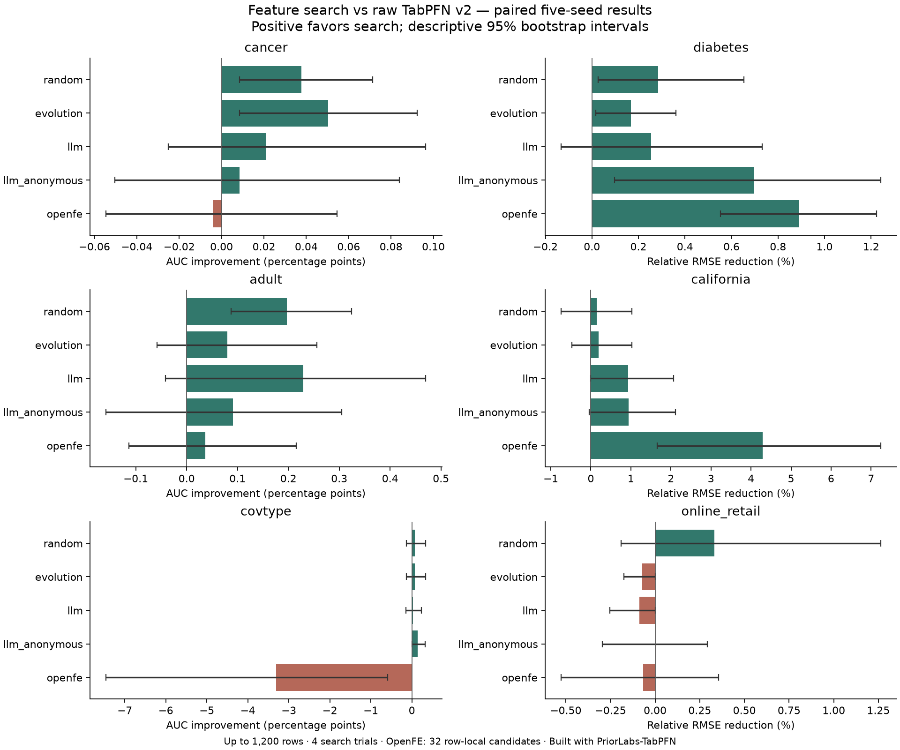

# TabPFN v2 多数据集基准结果

Built with PriorLabs-TabPFN

实验协议见 [PROTOCOL.md](PROTOCOL.md)，主指标、配对差值、Accuracy/MAE/R² 见 [对比数据](comparisons.md)，环境见 [ENVIRONMENT.md](ENVIRONMENT.md)。
结果解读与工程建议见 [benchmark 文档](../../README.md)。

原实验记录 240 次运行；成功 240，失败 0，未挑选有利 seed 补位。按仓库清理要求，现仅保留结论、汇总对比数据、协议及图表；逐次原始记录已删除，无法从本目录直接重新计算全部统计。

这些结果产生于 compiler/prompt 版本 3 更新之前；当前实现修复了分类编码、搜索方向和缓存身份，并扩展了 LLM 任务语义。新实现的效果须按独立协议重新评估。

## 外层测试结果

AUC 越高越好，RMSE 越低越好；每格为均值 ± 样本标准差。不同数据集数值不能直接横比。

| 数据集 | 原始 v2 | Random | Evolution | 语义 LLM | 匿名 LLM | OpenFE |
|---|---:|---:|---:|---:|---:|---:|
| cancer (auc) | 0.994675 ± 0.005024 | 0.995052 ± 0.005130 | 0.995178 ± 0.005146 | 0.994885 ± 0.005046 | 0.994759 ± 0.004892 | 0.994633 ± 0.004819 |
| diabetes (rmse) | 54.199618 ± 2.899725 | 54.046530 ± 2.919146 | 54.110517 ± 2.941881 | 54.067212 ± 3.038958 | 53.818118 ± 2.812009 | 53.720039 ± 2.929884 |
| adult (auc) | 0.917678 ± 0.018040 | 0.919652 ± 0.017796 | 0.918482 ± 0.016626 | 0.919968 ± 0.017050 | 0.918592 ± 0.019175 | 0.918043 ± 0.016459 |
| california (rmse) | 0.513744 ± 0.053667 | 0.512609 ± 0.049032 | 0.512518 ± 0.050919 | 0.508823 ± 0.051742 | 0.508341 ± 0.046182 | 0.492525 ± 0.062850 |
| covtype (auc_ovr) | 0.878224 ± 0.006824 | 0.878898 ± 0.008126 | 0.878898 ± 0.008126 | 0.878539 ± 0.007912 | 0.879611 ± 0.006674 | 0.845140 ± 0.045516 |
| online_retail (rmse) | 54.347465 ± 41.082267 | 54.274758 ± 41.204069 | 54.376907 ± 41.111448 | 54.438523 ± 41.232468 | 54.442500 ± 41.280137 | 54.238210 ± 40.820249 |

## 模型替换与框架收益分离

下表全部使用原始特征；此处的收益属于下游模型变化，不属于 Featune 特征搜索。

| 数据集 | Linear | HistGradientBoosting | TabPFN v2 |
|---|---:|---:|---:|
| cancer | 0.995178 ± 0.004390 | 0.991069 ± 0.006979 | 0.994675 ± 0.005024 |
| diabetes | 54.716173 ± 2.870912 | 58.821520 ± 2.800490 | 54.199618 ± 2.899725 |
| adult | 0.914486 ± 0.019288 | 0.902619 ± 0.022141 | 0.917678 ± 0.018040 |
| california | 0.671636 ± 0.080091 | 0.562466 ± 0.054018 | 0.513744 ± 0.053667 |
| covtype | 0.852607 ± 0.011000 | 0.849103 ± 0.020473 | 0.878224 ± 0.006824 |
| online_retail | 55.903620 ± 41.178106 | 46.978766 ± 28.528810 | 54.347465 ± 41.082267 |

## 相对原始 v2 的配对改善

分类单位为 AUC 百分点；回归为 RMSE 相对下降百分比。正值表示改善。区间仅基于 5 个随机划分，未作多重比较校正。

| 数据集 | 方法 | 改善均值 [95% CI] | 胜/平/配对数 | 搜索及评分耗时倍数 |
|---|---|---:|---:|---:|
| adult | evolution | +0.080 [-0.058, +0.256] | 2/2/5 | 4.26× |
| adult | llm | +0.229 [-0.041, +0.470] | 4/0/5 | 7.64× |
| adult | llm_anonymous | +0.091 [-0.158, +0.305] | 4/0/5 | 6.88× |
| adult | openfe | +0.037 [-0.113, +0.216] | 3/0/5 | 1.37× |
| adult | random | +0.197 [+0.088, +0.324] | 5/0/5 | 5.04× |
| california | evolution | +0.191 [-0.479, +1.024] | 2/2/5 | 3.77× |
| california | llm | +0.927 [-0.002, +2.068] | 4/0/5 | 7.00× |
| california | llm_anonymous | +0.938 [-0.046, +2.109] | 3/1/5 | 7.78× |
| california | openfe | +4.291 [+1.653, +7.244] | 5/0/5 | 1.88× |
| california | random | +0.143 [-0.742, +1.024] | 2/1/5 | 4.02× |
| cancer | evolution | +0.050 [+0.008, +0.092] | 3/2/5 | 2.70× |
| cancer | llm | +0.021 [-0.025, +0.096] | 1/2/5 | 7.71× |
| cancer | llm_anonymous | +0.008 [-0.050, +0.084] | 1/2/5 | 9.16× |
| cancer | openfe | -0.004 [-0.055, +0.055] | 2/0/5 | 1.38× |
| cancer | random | +0.038 [+0.008, +0.071] | 3/2/5 | 3.68× |
| covtype | evolution | +0.067 [-0.139, +0.341] | 1/3/5 | 2.62× |
| covtype | llm | +0.031 [-0.140, +0.234] | 1/3/5 | 5.64× |
| covtype | llm_anonymous | +0.139 [+0.003, +0.324] | 3/2/5 | 4.77× |
| covtype | openfe | -3.308 [-7.456, -0.590] | 0/0/5 | 0.74× |
| covtype | random | +0.067 [-0.139, +0.341] | 1/3/5 | 3.72× |
| diabetes | evolution | +0.168 [+0.017, +0.361] | 3/2/5 | 2.82× |
| diabetes | llm | +0.254 [-0.132, +0.732] | 4/0/5 | 17.70× |
| diabetes | llm_anonymous | +0.696 [+0.097, +1.242] | 4/0/5 | 15.10× |
| diabetes | openfe | +0.889 [+0.553, +1.224] | 5/0/5 | 3.62× |
| diabetes | random | +0.284 [+0.027, +0.654] | 4/1/5 | 3.84× |
| online_retail | evolution | -0.072 [-0.174, +0.000] | 0/3/5 | 2.36× |
| online_retail | llm | -0.089 [-0.254, +0.000] | 0/3/5 | 3.44× |
| online_retail | llm_anonymous | -0.002 [-0.297, +0.292] | 1/3/5 | 3.37× |
| online_retail | openfe | -0.066 [-0.526, +0.355] | 2/0/5 | 0.51× |
| online_retail | random | +0.333 [-0.190, +1.264] | 1/1/5 | 3.34× |

## 语义、效率与解释

- adult：正确语义相对匿名语义的方向统一原始指标改善 +0.001377，区间 [-0.001243, +0.004410]；5 对。
- california：正确语义相对匿名语义的方向统一原始指标改善 -0.000482，区间 [-0.009753, +0.007537]；5 对。
- cancer：正确语义相对匿名语义的方向统一原始指标改善 +0.000126，区间 [-0.000168, +0.000503]；5 对。
- covtype：正确语义相对匿名语义的方向统一原始指标改善 -0.001072，区间 [-0.003643, +0.001500]；5 对。
- diabetes：正确语义相对匿名语义的方向统一原始指标改善 -0.249094，区间 [-0.520580, +0.022633]；5 对。
- online_retail：正确语义相对匿名语义的方向统一原始指标改善 +0.003977，区间 [-0.042069, +0.053999]；5 对。

| 方法 | 平均搜索及评分秒数 | 平均后验解释秒数 | 平均派生列数 | 正依赖列/解释列 | 已知 token |
|---|---:|---:|---:|---:|---:|
| baseline | 26.43 | 0.00 | 0.00 | 0/0 | 0 |
| evolution | 68.66 | 25.01 | 0.70 | 18/21 | 0 |
| llm | 121.55 | 34.62 | 1.30 | 35/39 | 767,511 |
| llm_anonymous | 118.06 | 30.33 | 1.37 | 30/41 | 775,088 |
| openfe | 19.75 | 346.65 | 9.87 | 218/296 | 0 |
| random | 93.80 | 43.15 | 1.13 | 25/34 | 0 |

上表按完整数据集矩阵平均，需同时查看各数据集明细；正依赖数量受候选列数、相关性和采样误差影响，不是解释质量排名。Featune 最多新增 4 列、OpenFE 最多 10 列，列数上限不同，因此不能仅凭列数较少宣称算法更稀疏。

成功运行的提议状态汇总如下。预算是提议次数，重复提议不重新拟合，因此不同方法的实际拟合数可能不同：

| 方法 | 提议状态 | 次数 |
|---|---|---:|
| evolution | COMPLETE | 77 |
| evolution | DUPLICATE | 43 |
| llm | BUDGET_EXCEEDED | 4 |
| llm | COMPLETE | 116 |
| llm_anonymous | BUDGET_EXCEEDED | 4 |
| llm_anonymous | COMPLETE | 116 |
| random | COMPLETE | 120 |

LLM 已知 token 合计：1,542,599；未知计费请求：0。未配置单价，不能报告准确货币成本。

运行时生成的可解释性证据包括表达式/假设、CV 轨迹、来源及最终派生列置换结果；仓库现在只保留以下统计和实例，不再保留对应 JSON。置换只描述冻结模型对该列的依赖，不是因果证明；搜索中未开启置换，因此不能把 inconclusive 假设改写为已证实。

### 可解释性实例

固定展示各数据集最小 seed 的语义 LLM 运行中，导出顺序的第一条入选表达式，不挑最大收益或最高重要性。下表保留代表性表达式；逐次运行目录已清理。

| 数据集 / seed | 表达式 | LLM 提出的概念 | 置换分数下降均值 |
|---|---|---|---:|
| cancer / 11 | 未新增特征 | 保留原始模型 | — |
| diabetes / 11 | `divide(s2, s3)` | LDL to HDL cholesterol ratio | +0.410403 |
| adult / 11 | `group_mean(occupation, education_num)` | Occupational education level | +0.027920 |
| california / 11 | `divide(AveBedrms, AveRooms)` | Bedroom share of total rooms as a proxy for housing quality and layout | +0.018299 |
| covtype / 11 | `add(Soil_Type_0, Soil_Type_1)` | Aggregated presence of two adjacent soil type indicators | +0.000381 |
| online_retail / 11 | `log1p_abs(unit_price)` | Compressed price scale | +0.057086 |

置换下降使用原始评分单位：AUC 下降或 RMSE 上升，不能跨数据集比较；单列依赖也不等于新增该列相对原始模型的净收益。LLM 的领域理由需要人工核查。例如 California/seed11 的理由谈及梯度提升树的轴对齐切分，而实际下游模型是 TabPFN；CoverType/seed11 对相邻土壤编码存在共同地质含义的推测，也没有在本实验中验证。可追溯不代表解释必然正确。

## 适用范围与限制

- 使用最多 1,200 行子样本，不能声称在完整 CoverType/Online Retail 上取得同等收益；Online Retail 是 IID 交易划分，不代表时间或客户外推。
- 原始 v2 基线也运行 3-fold CV 和最终 refit，其耗时不是单次裸模型 fit 成本。OpenFE 使用自己的 LightGBM 筛选预算，内部拟合数未知，不能声称严格资源公平。
- 耗时使用 time.monotonic() 差值，包含搜索、refit、输出工件和一次主指标评分；不包含数据下载和预热。次指标和后验解释单独计时，不把整项任务的实际起止历时当成算法耗时。方法顺序固定、预热一次，系统负载仍会带来波动。
- v2 分类权重经过上游微调，公共数据预训练重合风险未排除；这不是无污染的新任务泛化证明。
- 匿名组只隐藏列名、描述和任务目标，保留数值及类别取值；这是字段元数据消融，不保证 LLM 完全无法识别领域或数据集。
- 无选择性删除失败或只展示获胜任务；小预算、五 seed 的结果不能证明普遍领先。

## English summary

Paired six-dataset, five-seed small-sample comparison using pinned TabPFN v2. Positive deltas favor feature search. All failures and neutral/negative results are retained. Bootstrap intervals are descriptive; OpenFE budgets differ. Feature lineage and permutation reliance are audit evidence, not causal explanations.

## 成功 CV 的耗时拆解

TabPFN 对照中，成功 CV 的特征编译合计 18.42 秒，占已记录编译/拟合/预测/解释时间的 0.201%。详见 [分项计时汇总](comparisons.md)。此口径不含 LLM、失败尝试或最终 refit，不能替代端到端速度比较。
